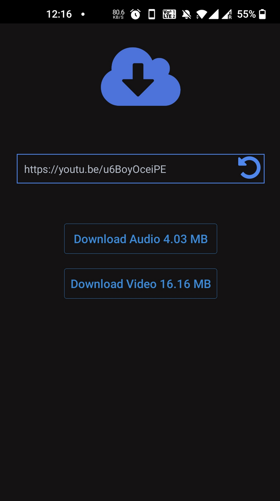

# Youtube Download Android App



## Development Setup

Install requirements:
`yarn global add expo-cli`
`yarn install`

RUN:
`expo start`

## Local Build and Create APK file

`expo export --dev --public-url http://127.0.0.1:8000`
This command will create a dist directory containing the iOS and Android JavaScript bundles and the different assets you are using.

```
dist
├── android-index.json
├── assets
│   ├── 13685372945d816a2b474fc082fd9aaa
│   ├── 140c53a7643ea949007aa9a282153849
│   ├── ...
│   ├── fdbedb7e67aa7c0ecad83d9c2fa4dfba
│   └── fdc01171a7a7ea76b187afcd162dee7d
├── bundles
│   ├── android-a9defc54fb2ffdb7e6fdaf5b8d0be751.js
│   └── ios-a29c3e4ac97a2abdc5208fd4f06e7708.js
└── ios-index.json
```

You can now serve the dist directory on your web server, e.g.
`npx http-server -p 8000 dist`

*Note: if for some reason you need to re-export your application (because you modified your app.json file since the last export, for instance), you must first remove the dist directory:*

```
# assuming you are at the root of the project
$ rm -rf dist
$ expo export --dev --public-url http://127.0.0.1:8000
```

### Create APK

First, verify that your local server is running. For example, you should see a similar output:
```$ curl http://127.0.0.1:8000/android-index.json
{"name":"ExampleApplication","slug":"ExampleApplication","version":"1.0.0","orientation":
```

For Turtle CLI to work correctly to create an .apk file for Android, you need to make sure the following dependency is installed: Java Development Kit (version 8).

```
$ turtle setup:android --sdk-version 40.0.1
Feb 4 08:20:37 turtle[48488] INFO:  Downloading Android SDK
  platform: "android"
  buildPhase: "setting up environment"
downloading [====================] 98% 0.5s
...
Feb 4 08:30:03 turtle[48488] INFO:  shell app for SDK 40.0.1 doesn't exist, downloading...
  platform: "android"
  buildPhase: "setting up environment"
downloading [=================== ] 94% 1.1s
Feb 4 08:30:23 turtle[48488] INFO:  shell app has been downloaded
  platform: "android"
  buildPhase: "setting up environment"
...
Feb 4 08:31:58 turtle[48488] INFO:  dependencies installed!
  platform: "android"
  buildPhase: "setting up environment"
Feb 4 08:31:58 turtle[48488] INFO:  it's all set!
  platform: "android"
```

### Create sign key

`$ npm install -g turtle-cli`

`$ keytool -genkeypair -v -keystore keystore.jks -alias keyalias -keyalg RSA -keysize 2048 -validity 9125`

```
File: keystore.jks
Keystore Password: keystorepassword
Keystore Key Alias: keyalias
Keystore Key Password: keypassword
```

### Build APK

Make sure that you are serving the dist directory on http://127.0.0.1:8000 as explained above in Run a local server. Assuming you are using bash as your shell, from the root of your project, run:

```
EXPO_ANDROID_KEYSTORE_PASSWORD="root123" \
EXPO_ANDROID_KEY_PASSWORD="root123" \
turtle build:android \
  --type apk \
  --keystore-path ./.secrets/keystore.jks \
  --keystore-alias "keyalias" \
  --allow-non-https-public-url \
  --public-url http://127.0.0.1:8000/android-index.json
```


Once it finishes, you should see this output in your terminal:

`Feb 5 08:34:22 turtle[11626] INFO:  copied build to ~/expo-apps/@anonymous__ExampleApplication-6d7e1749c5b64bd0851525b0c7eec780-signed.apk`

Take your .apk and share it through some Google Drive link or other medium of your choice.

Alternatively, if you connect an Android device to your computer, you should be able to run:

```
$ adb devices
emulator-5554	device
```
It is then possible to install the .apk file by running:

```
$ adb -s emulator-5554 install ~/expo-apps/@anonymous\\ExampleApplication-9be976cea1fb4651a6fa04d8432873eb-signed.apk
Performing Streamed Install
Success
```

[Ref](https://www.robincussol.com/build-standalone-expo-apk-ipa-with-turtle-cli/#3-publish-expo-app-on-local-server)
